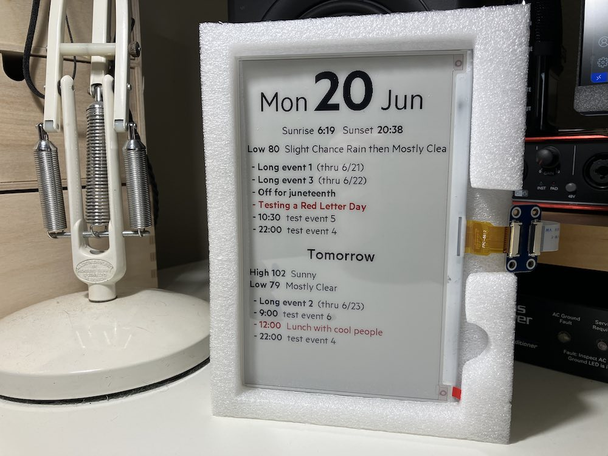

# iot-calendar-server

PHP web app that generates content for [iot-calendar-client](https://github.com/clockspot/iot-calendar-client) devices to consume.



Given a correct auth key from the client, it will process [NWS](https://www.weather.gov/documentation/services-web-api) and iCal data for predefined sources/locations (specified in the settings file) and return it as a [combined JSON object](#full-service-json-example).

`/cal` is a subset of that: given a correct auth key and iCal source URL (in theory), it will process that source and return it as JSON, in imitation of the [icalendar.org IoT Calendar Service](https://icalendar.org/iot.html). This is/was intended for use with a client that does more of the data fetching and processing on its own (e.g. [nano-test-local](https://github.com/clockspot/iot-calendar-client/tree/master/nano-test-local)), but at this writing I'm prioritizing the "full-service" approach described above and below.

iCal data is parsed with the [PHP ics-parser](https://github.com/u01jmg3/ics-parser) library.

### Full-service JSON example

At this writing, the full-service JSON looks like this:

```
[
    {
        "weekday": "Monday",
        "weekdayShort": "Mon",
        "weekdayRelative": "Today",
        "date": "20",
        "dateShort": "6\/20",
        "month": "June",
        "monthShort": "Jun",
        "sun": {
            "sunrise": "6:19",
            "sunset": "20:38",
            "transit": "13:29",
            "civil_twilight_begin": "5:51",
            "civil_twilight_end": "21:06",
            "nautical_twilight_begin": "5:16",
            "nautical_twilight_end": "21:42",
            "astronomical_twilight_begin": "4:37",
            "astronomical_twilight_end": "22:20"
        },
        "weather": [
            {
                "name": "Tonight",
                "isDaytime": false,
                "temperature": 80,
                "shortForecast": "Mostly Clear"
            }
        ],
        "events": [
            {
                "summary": "Long event 1",
                "allday": true,
                "duration": 2880,
                "dstart": "2022-06-20",
                "ldstart": "20220620",
                "dstartShort": "6\/20",
                "dend": "2022-06-21",
                "ldend": "20220621",
                "dendShort": "6\/21",
                "style": "black"
            }
        ]
    },
    {
        "weekday": "Tuesday",
        "weekdayShort": "Tue",
        "weekdayRelative": "Tomorrow",
        "date": "21",
        "dateShort": "6\/21",
        "month": "June",
        "monthShort": "Jun",
        "weather": [
            {
                "name": "Tuesday",
                "isDaytime": true,
                "temperature": 102,
                "shortForecast": "Sunny"
            },
            {
                "name": "Tuesday Night",
                "isDaytime": false,
                "temperature": 80,
                "shortForecast": "Mostly Clear"
            }
        ],
        "events": [
            {
                "summary": "Lunch with cool people",
                "allday": false,
                "ltstart": "1200",
                "timestart": "12:00",
                "duration": 60,
                "dstart": "2022-06-21",
                "ldstart": "20220621",
                "dstartShort": "6\/21",
                "dend": "2022-06-21",
                "ldend": "20220621",
                "dendShort": "6\/21",
                "style": "red"
            }
        ]
    }
]
```